# Dune
A 2D survival platformer set on the desert planet Arrakis. Play as Paul Atreides, navigate deadly sand dunes, avoid sandworms, fend off Harkonnen soldiers, and harvest spice to survive.

Built with **Unity 6.3 LTS** and **C#**.

🎮 [Play on Itch.io](https://breadstealer.itch.io/dune)  
📁 [GitHub Repository](https://github.com/bread-stealer/DJD1-Dune.git)

---

## How to Play

| Key | Action |
|-----|--------|
| A / D | Move left and right |
| W / Space | Jump |
| Space (tap) | Light Attack |
| Space (hold 1.5s) | Heavy Attack |
| E | Toggle shield on and off |
| Hold F | Harvest spice at a Spice Collector |
| Esc | Pause the game |

**Objective:** Locate the Spice Collector, hold F to harvest spice, then return to the Ship to complete the level. Watch your water supply > if it runs out, your health will begin to drain.

---

## Project Structure

```
Assets/
├── Scripts/
│   ├── Camera/
│   │   ├── CameraSystem.cs
│   │   └── CameraShake.cs
│   ├── Enemy/
│   │   ├── Enemy.cs
│   │   ├── EnemyStats.cs
│   │   ├── Harkonnen.cs
│   │   ├── Sandworm.cs
│   │   ├── SandwormManager.cs
│   │   └── WormHead.cs
│   ├── Player/
│   │   ├── AnimEventBridge.cs
│   │   ├── AttackData.cs
│   │   ├── PlayerAttack.cs
│   │   ├── PlayerAudio.cs
│   │   ├── PlayerController.cs
│   │   ├── PlayerHealth.cs
│   │   ├── PlayerHitFlash.cs
│   │   ├── PlayerShield.cs
│   │   └── PlayerWater.cs
│   ├── Audio/
│   │   ├── AudioManager.cs
│   │   └── SFXClip.cs
│   ├── UI/
│   │   ├── DamageNumber.cs
│   │   ├── DamageNumberSpawner.cs
│   │   ├── GameOverUI.cs
│   │   ├── HealthBarUI.cs
│   │   ├── MainMenuUI.cs
│   │   ├── ShieldUI.cs
│   │   ├── SpiceUI.cs
│   │   ├── WaterGaugeUI.cs
│   │   └── WinUI.cs
│   └── Gameplay/
│       ├── HitStop.cs
│       ├── SceneRef.cs
│       ├── SecretZone.cs
│       ├── ScrollGallery.cs
│       ├── SortingLayerAttribute.cs
│       ├── SpiceExtractor.cs
│       ├── SpiceManager.cs
│       ├── WaterCollectable.cs
│       └── WinDoor.cs
└── Editor/
    ├── SceneRefDrawer.cs
    └── SortingLayerDrawer.cs
```

---

## UML Diagram

```mermaid
classDiagram

%% ─── DATA STRUCTURES ───────────────────────────────────────────────
class AttackData {
    +float Damage
    +bool IsShieldPenetrating
}

class SFXClip {
    +AudioClip clip
    +float volume
}

class EnemyStats {
    +float MaxHealth
    +float MoveSpeed
    +float Damage
    +float AttackRange
    +float AttackCooldown
    +float DetectionRange
}

%% ─── PLAYER ────────────────────────────────────────────────────────
class PlayerController {
    +TakeDamage(AttackData) void
}

class PlayerHealth {
    +float CurrentHealth
    +float MaxHealth
    +bool IsDead
    +event OnHealthChanged
    +event OnDeath
}

class PlayerShield {
    +bool IsShieldActive
    +float CurrentStamina
    +bool IsOnCooldown
    +event OnShieldActivated
    +event OnShieldDeactivated
    +event OnShieldBroken
    +event OnShieldBlocked
    +event OnShieldRecharged
    +TryBlock(AttackData) bool
}

class PlayerAttack {
    -float lightDamage
    -float heavyDamage
    -float heavyAttackThreshold
}

class PlayerWater {
    +float CurrentWater
    +bool IsDehydrated
    +event OnWaterChanged
    +event OnDehydrated
    +event OnWaterRestored
    +Replenish(float) void
}

class PlayerAudio {
}

class PlayerHitFlash {
}

class AnimEventBridge {
    +event OnAttackHitEvent
    +event OnFootstepEvent
}

%% ─── ENEMY ─────────────────────────────────────────────────────────
class Enemy {
    <<abstract>>
    +TakeDamage(float, bool) void
}

class Harkonnen {
}

class Sandworm {
    +bool IsIdle
    +Trigger(Vector3) void
}

class WormHead {
    +SetActive(bool) void
}

class SandwormManager {
    +static Instance
}

%% ─── AUDIO ─────────────────────────────────────────────────────────
class AudioManager {
    +static Instance
    +PlaySFX(AudioClip, float, bool) void
    +PlayMusicWithFadeIn(AudioClip) void
    +FadeOutMusic() void
}

%% ─── CAMERA ────────────────────────────────────────────────────────
class CameraSystem {
    +SetShakeOffset(Vector3) void
}

class CameraShake {
    +StartShake(float, float) void
}

%% ─── GAMEPLAY ───────────────────────────────────────────────────────
class SpiceManager {
    +static Instance
    +int TotalSpice
    +event OnSpiceChanged
    +AddSpice(int) void
}

class SpiceExtractor {
}

class WaterCollectable {
}

class WinDoor {
}

class HitStop {
    +static Instance
    +Stop(float) void
}

class DamageNumberSpawner {
    +static Instance
    +Spawn(float, bool, Vector3) void
}

class DamageNumber {
    +Setup(float, bool) void
}

%% ─── UI ────────────────────────────────────────────────────────────
class HealthBarUI {
}

class ShieldUI {
}

class WaterGaugeUI {
}

class SpiceUI {
}

class GameOverUI {
    +OnRestartPressed() void
    +OnMainMenuPressed() void
}

class WinUI {
    +static event OnWin
    +ShowWinScreen() void
}

%% ─── RELATIONSHIPS ──────────────────────────────────────────────────

%% Inheritance
Enemy <|-- Harkonnen
Enemy <|-- Sandworm

%% Composition
PlayerController "1" *-- "1" PlayerShield
PlayerController "1" *-- "1" PlayerHealth
PlayerController "1" *-- "1" PlayerWater
PlayerController "1" *-- "1" PlayerAttack
PlayerController "1" *-- "1" PlayerAudio
PlayerController "1" *-- "1" PlayerHitFlash
Sandworm "1" *-- "1" WormHead

%% Aggregation
PlayerAttack "1" o-- "1" AnimEventBridge
PlayerAudio "1" o-- "1" AnimEventBridge
Enemy "*" o-- "1" EnemyStats
SandwormManager "1" o-- "1" Sandworm
CameraShake "1" o-- "1" CameraSystem

%% Dependency
PlayerController ..> AttackData
PlayerController ..> HitStop
PlayerAttack ..> AttackData
PlayerAttack ..> Enemy
PlayerShield ..> AttackData
Harkonnen ..> AttackData
Harkonnen ..> PlayerController
WormHead ..> PlayerController
WormHead ..> PlayerHealth
SpiceExtractor ..> SpiceManager
WinDoor ..> SpiceManager
WinDoor ..> WinUI
WaterCollectable ..> PlayerWater
DamageNumberSpawner "1" ..> "*" DamageNumber
AudioManager ..> PlayerHealth
AudioManager ..> WinUI
HealthBarUI ..> PlayerHealth
ShieldUI ..> PlayerShield
WaterGaugeUI ..> PlayerWater
SpiceUI ..> SpiceManager
GameOverUI ..> PlayerHealth
PlayerAudio ..> AudioManager
PlayerAudio ..> SFXClip
```



---

## Credits

Pixabay. (2024). *Nature: Strong desert wind* [Sound effect]. Pixabay. https://pixabay.com/sound-effects/nature-strong-desert-wind-155416/

Bfxr. (2025). *Bfxr: Make sound effects for your games* [Sound effect generator]. https://www.bfxr.net/

Pixabay. (2024). *Nature: Sandstorm* [Sound effect]. Pixabay. https://pixabay.com/sound-effects/nature-sandstorm-222741/

Pixabay. (2025). *Amurich Atma: Mysterious duduk* [Music]. Pixabay. https://pixabay.com/pt/music/mundo-amurich-atma-mysterious-duduk-337300/

Pixabay. (2024). *Film special effects: Sand walk* [Sound effect]. Pixabay. https://pixabay.com/sound-effects/film-special-effects-sand-walk-106366/

Pixabay. (2024). *Walking on rocks 02* [Sound effect]. Pixabay. https://pixabay.com/pt/sound-effects/filme-e-efeitos-especiais-walking-on-rocks-02-55515/

Craftpix. (2021). Pixel art full GUI UI kit — 151 icons [UI Asset]. Unity Asset Store. https://assetstore.unity.com/packages/2d/gui/pixel-art-full-gui-ui-kit-151-icons-205222
